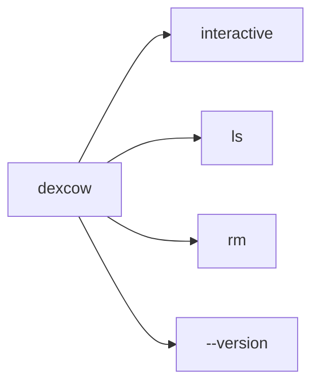
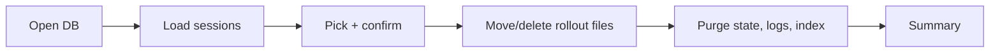
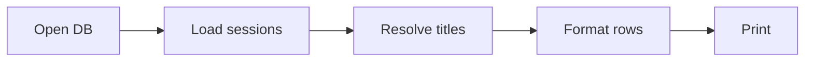
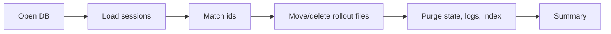
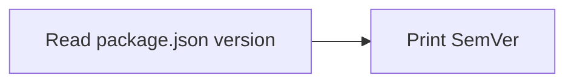

# dexcow 🐄

A cow that eats your Codex sessions.

Codex doesn't let you delete sessions from its GUI. `dexcow` is a tiny terminal tool that reads Codex's own session index and lets you pick sessions to remove — interactively, with titles that match what you see in Codex.

## Install

```bash
bun install -g dexcow
# or, from source:
git clone git@github.com:lemonbu5h/dexcow.git && cd dexcow
bun install && bun link
```

## Use

```bash
dexcow              # interactive multiselect
dexcow ls           # list sessions (pipeable)
dexcow rm <id>...   # delete by id
dexcow --version    # print SemVer package version
dexcow --hard       # skip trash, purge immediately
```

Deleted sessions are purged from Codex's local indexes and logs. Rollout files move to `~/.codex/.dexcow-trash/<date>/` by default; use `--hard` to delete those rollout files immediately.

## Flow

### Command map



### Interactive delete

Related files: `src/index.ts`, `src/commands.ts`, `src/purge.ts`, `src/threads.ts`, `src/sessionIndex.ts`, `src/trash.ts`.



### List sessions

Related files: `src/index.ts`, `src/commands.ts`, `src/threads.ts`, `src/sessionIndex.ts`, `src/format.ts`.



### Remove by id

Related files: `src/index.ts`, `src/commands.ts`, `src/purge.ts`, `src/threads.ts`, `src/sessionIndex.ts`, `src/trash.ts`.



### Version

Related files: `src/index.ts`, `src/version.ts`, `package.json`.



## Versioning

`dexcow` uses the SemVer-compatible `version` field in `package.json` as its release version:

```bash
$ dexcow --version
0.1.0
```

Release bumps should update `package.json`; the CLI reads from that single source of truth.

## What it purges

- Removes thread rows from `~/.codex/state_5.sqlite`.
- Removes related rows from `thread_dynamic_tools`, `thread_spawn_edges`, and `stage1_outputs` when those tables exist.
- Clears `agent_job_items.assigned_thread_id` when that column exists.
- Removes matching `thread_id` rows from `~/.codex/logs_2.sqlite` when the logs database exists.
- Removes matching entries from `~/.codex/session_index.jsonl`.
- Moves or deletes rollout files under `~/.codex/sessions/`.
- Leaves `auth.json`, `config.toml`, memories, and skills alone.

Set `CODEX_HOME` to point at a non-default Codex directory.

## Dev

```bash
bun install
bun run dev                 # run from source
bun run typecheck
bun test
bun run build               # bundle to dist/dexcow.js
bun run compile             # standalone binary dist/dexcow
```

## License

MIT
