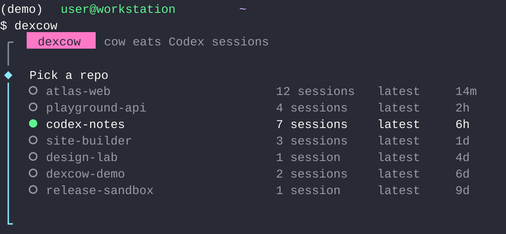
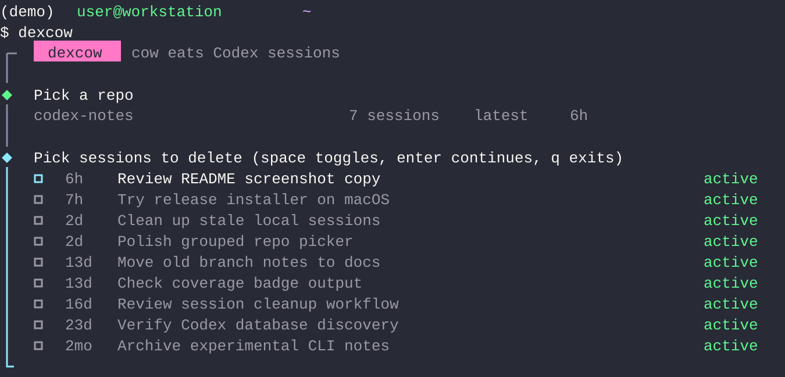

# dexcow

[](https://github.com/lemonbu5h/dexcow/actions/workflows/ci.yml)
[](https://codecov.io/gh/lemonbu5h/dexcow)
[](https://github.com/lemonbu5h/dexcow/actions/workflows/release.yml)
[](https://bun.sh)

Delete local Codex sessions from your terminal. Pick a repo, select sessions, and confirm.

**Prefer the built-in option?** In Codex, archive a session, then open **Settings → Archived chats** to delete it. No extra tool needed.

Use dexcow to select multiple sessions by repo. An [agent skill](docs/usage.md#agent-skill) is also available.

## Demo

<p>
  
</p>

<p>
  
</p>

## Quick Start

macOS Apple Silicon and Linux x64. **No Bun installation required.**

```bash
curl -fsSL https://raw.githubusercontent.com/lemonbu5h/dexcow/main/install.sh | sh
dexcow
```

Press space to select sessions, then enter to review the selected sessions and confirm permanent deletion.

Run `dexcow help` for commands, or `dexcow archived` to select archived sessions for deletion.

[Manual downloads](https://github.com/lemonbu5h/dexcow/releases/latest) · [Agent skill setup](docs/usage.md#agent-skill) · [Run from source](docs/development.md)

## Safety

**Deletion is permanent.** Review your selection before confirming. Locked sessions cannot be selected.

Dexcow edits local Codex storage, whose format can change between updates. It leaves your project files and Codex settings alone. See [what gets deleted](docs/architecture.md#purge-scope).

## Documentation

- [Usage and agent skill](docs/usage.md)
- [Development and source installation](docs/development.md)
- [Architecture and deletion scope](docs/architecture.md)
- [Release process](docs/release.md)

## License

MIT. See [LICENSE](./LICENSE).
