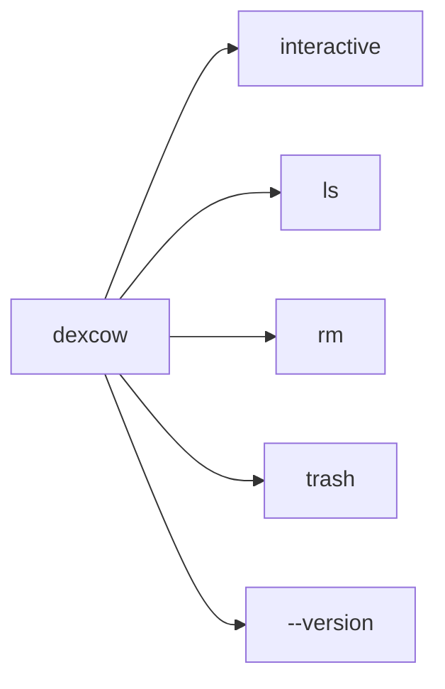
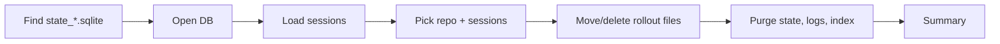
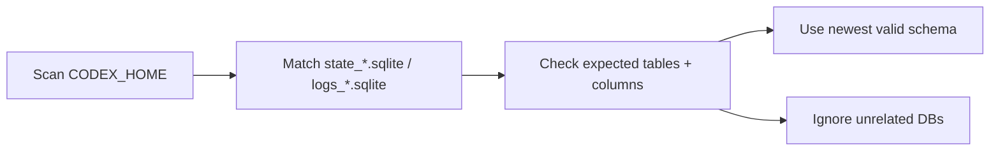
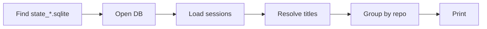
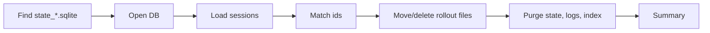
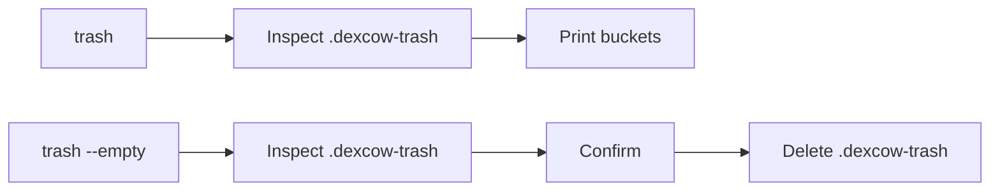

# Architecture

## Flow

### Command map



### Interactive delete

Related files: `src/index.ts`, `src/commands.ts`, `src/purge.ts`, `src/threads.ts`, `src/sessionIndex.ts`, `src/trash.ts`.



### Store discovery

Related files: `src/codexStores.ts`, `src/paths.ts`, `src/threads.ts`, `src/purge.ts`.



`dexcow` treats Codex's numbered SQLite filenames as internal schema generations. It prefers the newest matching file with the expected schema instead of relying on one hardcoded filename. Nested databases such as `~/.codex/sqlite/codex-dev.db` are outside the session purge scope.

### List sessions

Related files: `src/index.ts`, `src/commands.ts`, `src/threads.ts`, `src/sessionIndex.ts`, `src/format.ts`.



### Remove by id

Related files: `src/index.ts`, `src/commands.ts`, `src/purge.ts`, `src/threads.ts`, `src/sessionIndex.ts`, `src/trash.ts`.



## Purge Scope

`dexcow` removes:

- thread rows from the newest valid `~/.codex/state_*.sqlite`
- related rows from `thread_dynamic_tools`, `thread_spawn_edges`, and `stage1_outputs` when those tables exist
- `agent_job_items.assigned_thread_id` references when that column exists
- matching `thread_id` rows from the newest valid `~/.codex/logs_*.sqlite` when the logs database exists
- matching entries from `~/.codex/session_index.jsonl`
- rollout files under `~/.codex/sessions/`

It leaves `auth.json`, `config.toml`, memories, skills, and `~/.codex/sqlite/codex-dev.db` alone.

## Trash

Related files: `src/index.ts`, `src/commands.ts`, `src/trash.ts`.



## Test Coverage

Coverage uses Bun's native test runner. Local and CI coverage share `bunfig.toml`, skip test files, emit text and LCOV reports, and require at least 80% line and function coverage.

```bash
bun run coverage
```

CI uploads `coverage/lcov.info` to Codecov for the README coverage badge.
