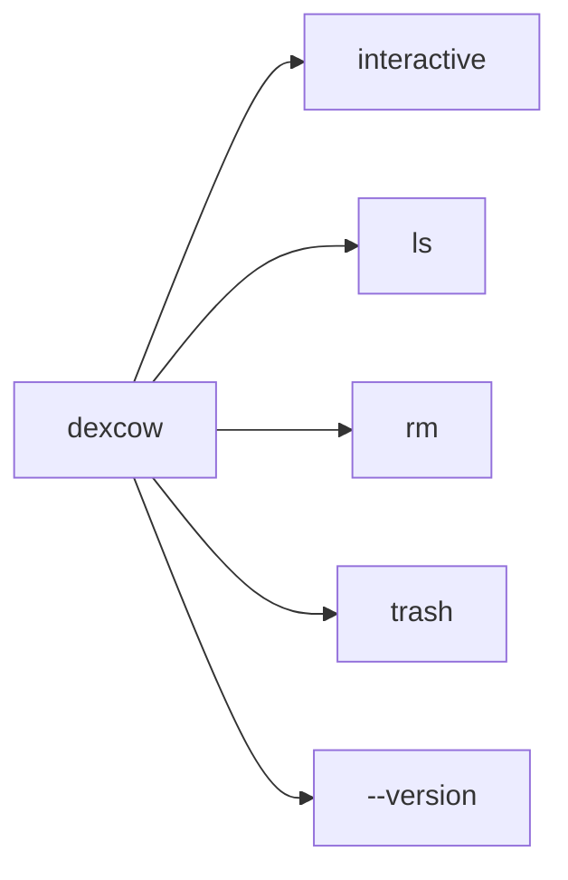
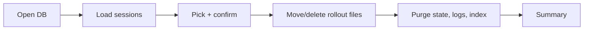
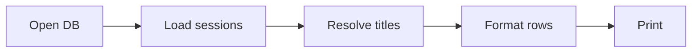
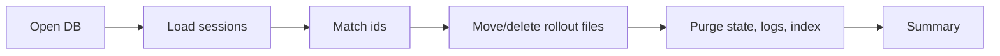
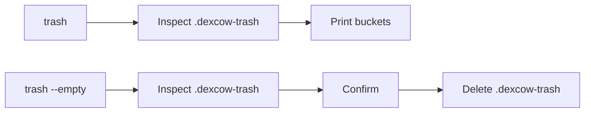

# Architecture

## Flow

### Command map

### Interactive delete

Related files: `src/index.ts`, `src/commands.ts`, `src/purge.ts`, `src/threads.ts`, `src/sessionIndex.ts`, `src/trash.ts`.

### List sessions

Related files: `src/index.ts`, `src/commands.ts`, `src/threads.ts`, `src/sessionIndex.ts`, `src/format.ts`.

### Remove by id

Related files: `src/index.ts`, `src/commands.ts`, `src/purge.ts`, `src/threads.ts`, `src/sessionIndex.ts`, `src/trash.ts`.

## Purge Scope

`dexcow` removes:

- thread rows from `~/.codex/state_5.sqlite`
- related rows from `thread_dynamic_tools`, `thread_spawn_edges`, and `stage1_outputs` when those tables exist
- `agent_job_items.assigned_thread_id` references when that column exists
- matching `thread_id` rows from `~/.codex/logs_2.sqlite` when the logs database exists
- matching entries from `~/.codex/session_index.jsonl`
- rollout files under `~/.codex/sessions/`

It leaves `auth.json`, `config.toml`, memories, and skills alone.

## Trash

Related files: `src/index.ts`, `src/commands.ts`, `src/trash.ts`.

