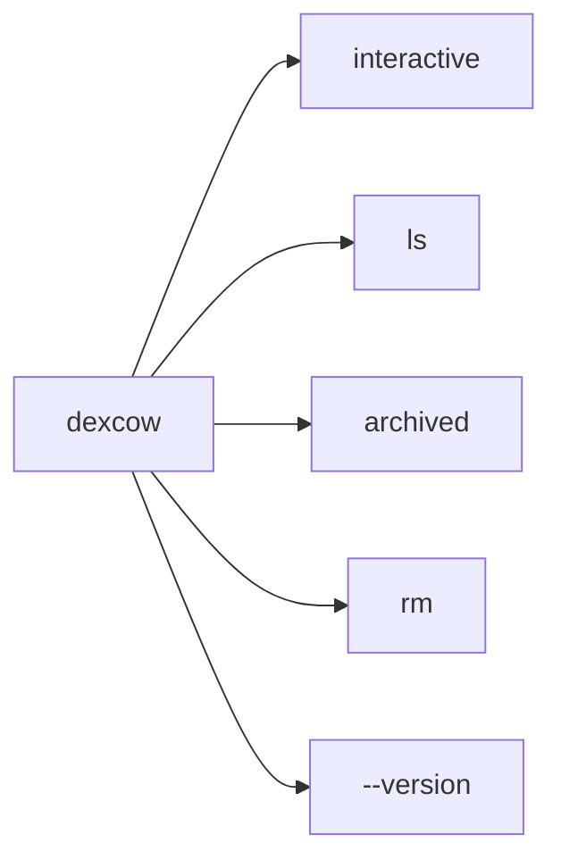
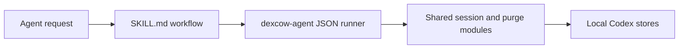
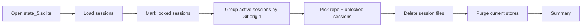
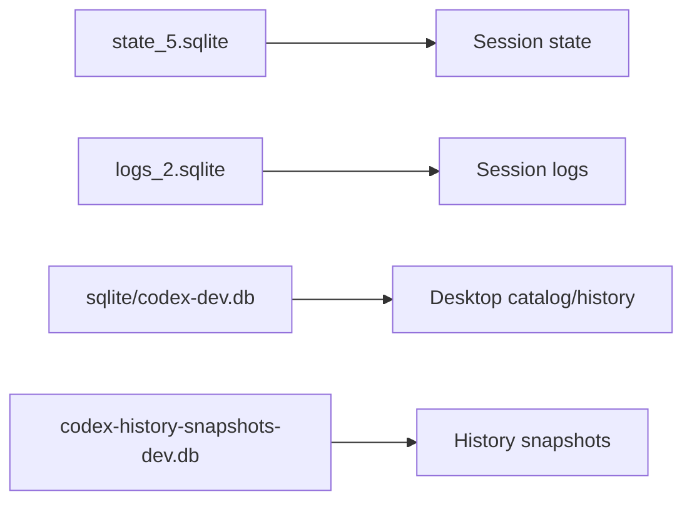
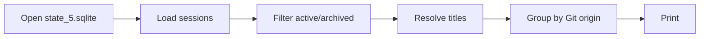
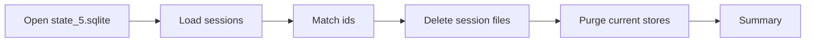

# Architecture

## Flow

### Command map


```mermaid
flowchart LR
  A["dexcow"] --> B["interactive"]
  A --> C["ls"]
  A --> D["archived"]
  A --> E["rm <id...>"]
  A --> F["--version"]
```

### Agent skill

Related files: `skills/dexcow/SKILL.md`, `src/agent.ts`, `src/purge.ts`, `src/threads.ts`, `src/rolloutFiles.ts`.


```mermaid
flowchart LR
  A["Agent request"] --> B["SKILL.md workflow"]
  B --> C["dexcow-agent JSON runner"]
  C --> D["Shared session and purge modules"]
  D --> E["Local Codex stores"]
```

The bundled agent runner is separate from the interactive CLI/TUI, but both front ends reuse the same session discovery and purge modules. The skill requires Bun to run its bundled JavaScript; the standalone release binary does not.

### Interactive delete

Related files: `src/index.ts`, `src/commands.ts`, `src/purge.ts`, `src/threads.ts`, `src/desktopCatalog.ts`, `src/sessionIndex.ts`, `src/rolloutFiles.ts`, `src/sessionArtifacts.ts`.


```mermaid
flowchart LR
  A["Open state_5.sqlite"] --> B["Load sessions"]
  B --> C["Mark locked sessions"]
  C --> D["Group active sessions by Git origin"]
  D --> E["Pick repo + unlocked sessions"]
  E --> F["Delete session files"]
  F --> H["Purge current stores"]
  H --> G["Summary"]
```

### Current store layout

Related files: `src/codexStores.ts`, `src/paths.ts`, `src/threads.ts`, `src/purge.ts`, `src/desktopStores.ts`.


```mermaid
flowchart LR
  A["state_5.sqlite"] --> B["Session state"]
  C["logs_2.sqlite"] --> D["Session logs"]
  E["sqlite/codex-dev.db"] --> F["Desktop catalog/history"]
  G["codex-history-snapshots-dev.db"] --> H["History snapshots"]
```

These are private Codex implementation details, not a stable public API. Dexcow targets the current schema explicitly so storage drift fails visibly and can be updated promptly.

### List sessions

Related files: `src/index.ts`, `src/commands.ts`, `src/threads.ts`, `src/desktopCatalog.ts`, `src/sessionIndex.ts`, `src/format.ts`.


```mermaid
flowchart LR
  A["Open state_5.sqlite"] --> B["Load sessions"]
  B --> D["Filter active/archived"]
  D --> E["Resolve titles"]
  E --> H["Group by Git origin"]
  H --> F["Print"]
```

### Remove by id

Related files: `src/index.ts`, `src/commands.ts`, `src/purge.ts`, `src/threads.ts`, `src/sessionIndex.ts`, `src/rolloutFiles.ts`, `src/sessionArtifacts.ts`.


```mermaid
flowchart LR
  A["Open state_5.sqlite"] --> B["Load sessions"]
  B --> D["Match ids"]
  D --> E["Delete session files"]
  E --> F["Purge current stores"]
  F --> G["Summary"]
```

## Purge Scope

`dexcow` removes:

- thread rows and related `thread_dynamic_tools` and `thread_spawn_edges` rows from `~/.codex/state_5.sqlite`
- matching log rows from `~/.codex/logs_2.sqlite` when it exists
- matching entries from `~/.codex/session_index.jsonl`
- rollout files under `~/.codex/sessions/` and `~/.codex/archived_sessions/`
- matching files from `~/.codex/shell_snapshots/`
- matching catalog, timeline, automation-run, and inbox rows from `~/.codex/sqlite/codex-dev.db` when it exists
- matching rows from `~/.codex/sqlite/codex-history-snapshots-dev.db` when it exists

It leaves authentication, configuration, memories, goals, skills, attachments, worktrees, global UI state, and automation definitions alone.

The interactive picker shows sessions with a matching `thread-writer-locks/<id>.lock` file as locked but excludes them from the checkbox list. It checks again before confirmation, and the purge layer performs a final lock check before changing anything.

State-store discovery validates the root `~/.codex/state_5.sqlite` schema and never falls back to stale nested copies. SQLite busy errors are retried briefly; missing, temporarily unavailable, and unsupported stores remain distinct error states.

## JSONL Handling

`session_index.jsonl` currently contains `id`, `thread_name`, and `updated_at`; dexcow uses it as a title fallback and removes every entry matching a purged id. Display titles prefer `threads.name`, then the Desktop catalog title, then the session index, matching current Codex metadata as closely as possible. Rollout JSONL files contain evolving event and response-item types, but dexcow deletes each selected file as an opaque artifact and does not depend on its internal event schema.

## Test Coverage

Coverage uses Bun's native test runner. Local and CI coverage share `bunfig.toml`, skip test files, emit text and LCOV reports, and require at least 80% line and function coverage.

```bash
bun run coverage
```

CI uploads `coverage/lcov.info` to Codecov for the README coverage badge.
